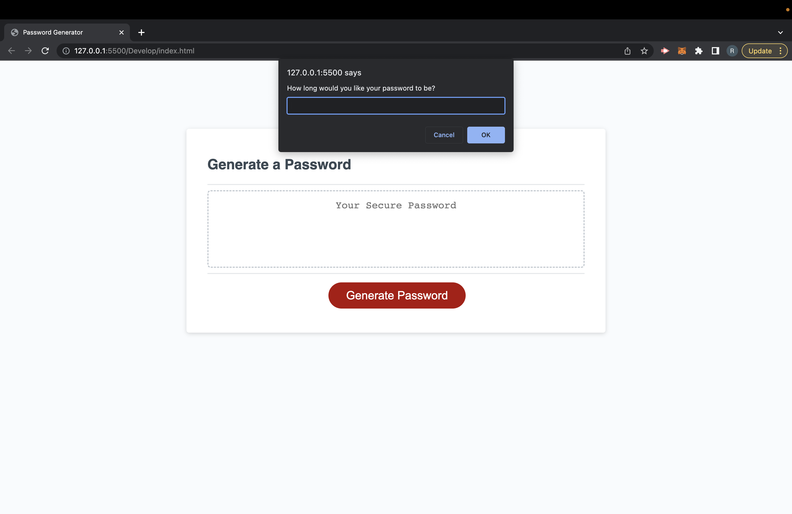
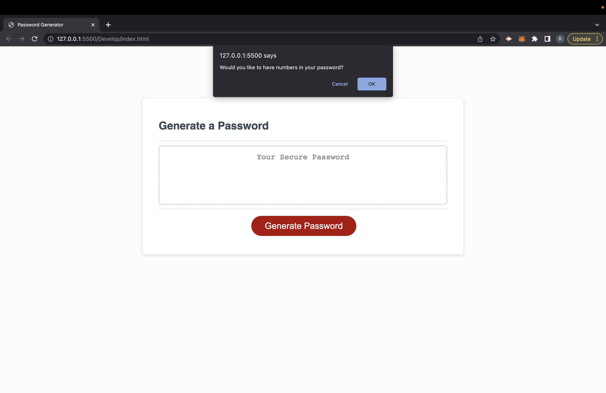
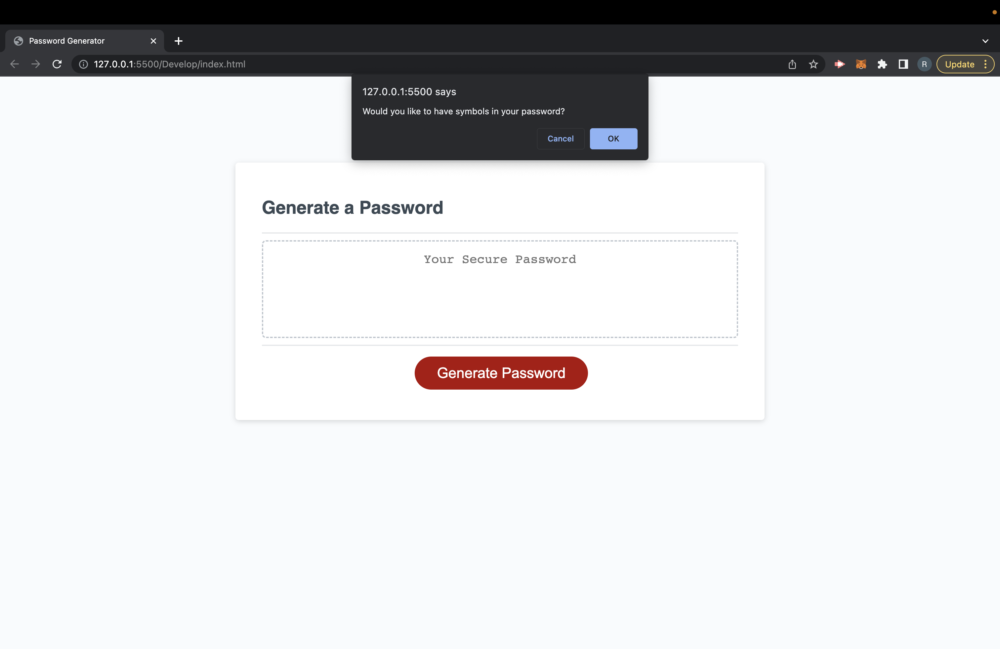
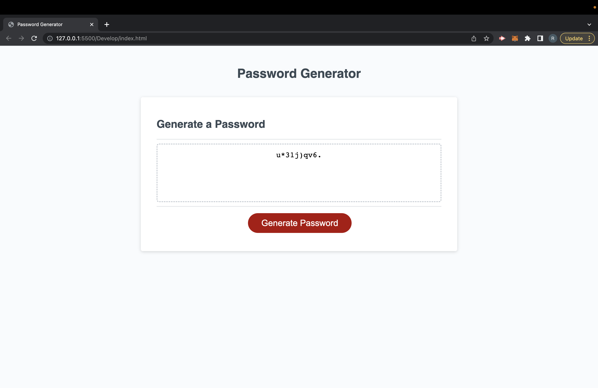

# <Javascript password generator>

## Description

Password generators are a good application that is needed for those who tend to use the same password for everything. Using the same password for many different apps and websites can allow for someone to have access to your entire life. This password generator will take the thinking away of having to create a new password everytime you sign up for something new. The alert boxes make it really easy to choose the criteria that you want in your password. The first alert box will ask you how many characters, followed by asking the criteria you want in your password. Once the password is created you can then copy and paste it wherever you want.

## Installation

(add url here)

## Usage

## License

MIT License

Copyright (c) 2022 ricky-rosay

Permission is hereby granted, free of charge, to any person obtaining a copy of this software and associated documentation files (the "Software"), to deal in the Software without restriction, including without limitation the rights to use, copy, modify, merge, publish, distribute, sublicense, and/or sell copies of the Software, and to permit persons to whom the Software is furnished to do so, subject to the following conditions:

The above copyright notice and this permission notice shall be included in all copies or substantial portions of the Software.

THE SOFTWARE IS PROVIDED "AS IS", WITHOUT WARRANTY OF ANY KIND, EXPRESS OR IMPLIED, INCLUDING BUT NOT LIMITED TO THE WARRANTIES OF MERCHANTABILITY, FITNESS FOR A PARTICULAR PURPOSE AND NONINFRINGEMENT. IN NO EVENT SHALL THE AUTHORS OR COPYRIGHT HOLDERS BE LIABLE FOR ANY CLAIM, DAMAGES OR OTHER LIABILITY, WHETHER IN AN ACTION OF CONTRACT, TORT OR OTHERWISE, ARISING FROM, OUT OF OR IN CONNECTION WITH THE SOFTWARE OR THE USE OR OTHER DEALINGS IN THE SOFTWARE.
